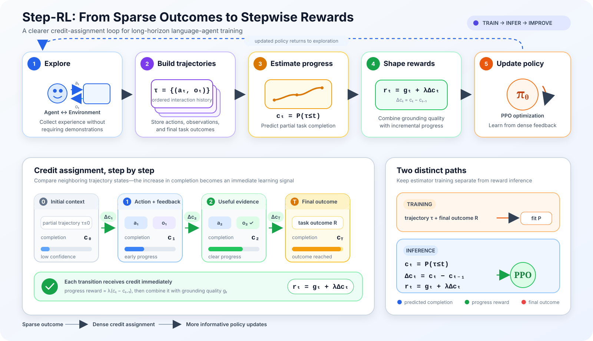

<div align="center">

# Step-RL

**Stepwise rewards for training long-horizon language agents**

Turn sparse task outcomes into fine-grained progress signals for supervised fine-tuning, trajectory exploration, reward estimation, PPO training, and evaluation.

English · [简体中文](README_zh.md)


[](LICENSE)

[Overview](#overview) · [Pipeline](#pipeline) · [Installation](#installation) · [Usage](#usage) · [Project layout](#project-layout) · [License](#license)

</div>

---

## Overview

Step-RL is a research-oriented toolkit for reinforcement learning with multi-step language agents. It focuses on a common difficulty in long-horizon tasks: the environment usually provides a useful reward only at the end of a trajectory, making it difficult to identify which intermediate actions helped or hurt.

The project organizes an end-to-end workflow around stepwise progress estimation:

- supervised fine-tuning of a base agent;
- trajectory collection through environment interaction;
- progress-estimator training;
- step-level reward annotation;
- LoRA-based PPO optimization;
- evaluation on interactive agent environments.

The repository currently includes integrations and scripts for **WebShop**, **ALFWorld**, and **VirtualHome**. The WebShop path contains the most complete checked-in exploration workflow; the other environments require additional datasets, checkpoints, and environment-specific configuration.

<p align="center">
  
</p>

## Why stepwise rewards?

Traditional outcome rewards treat a trajectory as a single success or failure. Step-RL instead estimates how much progress is made at each step, which provides a denser learning signal for long, multi-turn interactions.

| Challenge | Step-RL approach |
| --- | --- |
| Sparse terminal rewards | Redistribute trajectory-level outcomes into intermediate rewards |
| Long credit-assignment horizon | Estimate progress changes between consecutive steps |
| Expensive online interaction | Reuse collected trajectories for reward-model and PPO training |
| Multi-environment evaluation | Keep task environments behind a shared agent/evaluation interface |

## Pipeline

```mermaid
flowchart LR
    A[Expert trajectories] --> B[Base-agent SFT]
    B --> C[Environment exploration]
    C --> D[Collected trajectories]
    D --> E[Progress-estimator training]
    E --> F[Stepwise reward annotation]
    F --> G[PPO data construction]
    G --> H[LoRA-based PPO training]
    H --> I[Checkpoint merge]
    I --> J[Agent evaluation]
```



### Core stages

1. **SFT** builds a task-following base policy from expert trajectories.
2. **Exploration** lets the base policy interact with an environment and records complete trajectories.
3. **Progress estimation** learns to score partial task completion.
4. **Reward annotation** converts progress changes into step-level learning signals.
5. **PPO** improves the policy using the annotated trajectories.
6. **Evaluation** measures the resulting agent in the target environment.

## Project layout

```text
Step-RL/
├── assets/          # Architecture and documentation images
├── config/          # PPO and training configuration
├── envs/            # Interactive environments, including WebShop
├── eval/            # Evaluation launch scripts
├── eval_agent/      # Shared agents, tasks, prompts, and environment adapters
├── exploration/     # Trajectory collection scripts and sample outputs
├── fastchat/        # Adapted training and serving components
├── ppo/             # Stepwise PPO implementation and checkpoint merging
├── prm/             # Progress-estimator training and data processing
├── sft/             # Supervised fine-tuning scripts
├── LICENSE
└── requirements.txt
```

## Requirements

Full training is designed for a Linux machine with NVIDIA GPUs.

- Python 3.9 for agent environments and evaluation;
- Python 3.10 for PPO training;
- CUDA-compatible PyTorch;
- one or more NVIDIA GPUs with enough memory for the selected model;
- Java 11 for the WebShop search environment;
- sufficient storage for models, datasets, search indexes, and checkpoints.

> macOS can be used for reading the code and running lightweight data-processing tasks, but the provided CUDA, vLLM, FlashAttention, DeepSpeed, and distributed-training commands are intended for Linux/NVIDIA environments.

## Installation

### 1. Clone the repository

```bash
git clone https://github.com/Shaw-Liu7/Step-Reinforcement-Learning.git
cd Step-RL
```

### 2. Create the evaluation environment

Install a PyTorch build that matches your CUDA version first, then install the project dependencies.

```bash
conda create -n step-rl-eval python=3.9 -y
conda activate step-rl-eval

# Install a CUDA-compatible PyTorch build for your machine first.
pip install -r requirements.txt
pip install -r eval_agent/requirements.txt
pip install gdown
```

The evaluation code currently uses the legacy OpenAI Python client interface, so `eval_agent/requirements.txt` pins a compatible client version.

### 3. Install WebShop

```bash
pip install -e envs/webshop
python -m spacy download en_core_web_lg
conda install -y -c conda-forge openjdk=11
```

### 4. Create the PPO environment

PPO training uses a separate environment because its package versions differ from the evaluation stack.

```bash
conda create -n step-rl-train python=3.10 -y
conda activate step-rl-train
pip install -r ppo/requirements.txt
```

## Data preparation

The datasets and indexes are not fully stored in this repository. Run the following commands from the repository root.

### WebShop

```bash
cd envs/webshop

gdown "https://drive.google.com/uc?id=1G_0ccLWn5kZE5rpeyAdh_YuoNzvBUjT9" -O webshop_data.zip
gdown "https://drive.google.com/uc?id=11zOUDkJSgGhYin9NxQtG8PVpDsika86y" -O webshop_indexes.zip

unzip webshop_data.zip
mkdir -p search_index
unzip webshop_indexes.zip -d search_index/

cd ../..
```

### ALFWorld

```bash
mkdir -p eval_agent/data/alfworld
gdown "https://drive.google.com/uc?id=1y7Vqeo0_xm9d3I07vZaP6qbPFtyuJ6kI" \
  -O eval_agent/data/alfworld/alfworld_data.zip
unzip eval_agent/data/alfworld/alfworld_data.zip -d eval_agent/data/alfworld/
```

### VirtualHome

```bash
gdown "https://drive.google.com/uc?id=1kZKWkWhtJ-DneqfS1Nb_FybR1RBxPeef" \
  -O virtualhome_master.zip
unzip virtualhome_master.zip
```

### Expert trajectories

```bash
gdown "https://drive.google.com/uc?id=1_tBMDixZcIjKuv-LExNllha-YIRxhKIq" \
  -O expert_trajectories.zip
unzip expert_trajectories.zip
```

Before training, verify that the paths referenced by the SFT and evaluation scripts match the extracted directory structure.

## Configuration

The launch scripts contain reproducibility-oriented defaults and must be adapted to your machine.

| Setting | Where to update |
| --- | --- |
| Base-model path | `sft/*.sh`, `ppo/train_ppo.sh`, `eval/*.sh` |
| CUDA devices | `CUDA_VISIBLE_DEVICES` in launch scripts |
| GPU count | `node_num` and `--nproc_per_node` in SFT scripts |
| Checkpoint paths | `ckt/`, `ckpt/`, and `MODEL_PATH` values |
| PPO hyperparameters | `config/StepTool_ppo.json` |
| Environment data | `eval_agent/configs/task/*.json` |
| Output directories | evaluation, exploration, PRM, and PPO launch arguments |
| Controller/worker ports | exploration and evaluation scripts |

Avoid committing local absolute paths, API keys, model weights, or experiment credentials. Prefer environment variables and command-line arguments for machine-specific settings.

## Usage

All commands below assume the current directory is the repository root.

### 1. Supervised fine-tuning

Choose the target environment and update its model, data, GPU, and output paths before launching.

```bash
# WebShop
bash sft/webshop_llama3b.sh

# ALFWorld
bash sft/alfworld_llama3b.sh

# VirtualHome
bash sft/virtualhome_llama3b.sh
```

### 2. WebShop trajectory exploration

Run the controller, model worker, and exploration client in separate terminals.

Terminal 1 — controller:

```bash
conda activate step-rl-eval
bash exploration/webshop/run_controller.sh
```

Terminal 2 — model worker:

```bash
conda activate step-rl-eval
bash exploration/webshop/run_vllm.sh
```

Terminal 3 — exploration client:

```bash
conda activate step-rl-eval
python exploration/webshop/generate_response_webshop.py \
  --agent_config fastchat_explore \
  --iteration_num 3 \
  --exp_config webshop \
  --model_name llama3b_webshop_sft_loramerged \
  --part_num 1 \
  --part_idx 0 \
  --save_path exploration/webshop/exploration_outputs/explore
```

### 3. Progress-estimator data construction

```bash
python prm/data_org.py
```

Inspect the input and output paths in the script before running it against a new trajectory collection.

### 4. Progress-estimator training

```bash
deepspeed --include=localhost:0,1,2,3 prm/train_our_progress_model.py
```

Alternative LoRA and reduced-precision training scripts are also available under `prm/`.

### 5. Stepwise reward annotation

```bash
python prm/inference_prm.py
```

### 6. PPO data construction

```bash
python prm/rl_data_org.py
```

### 7. PPO training

```bash
conda activate step-rl-train
bash ppo/train_ppo.sh
```

### 8. Merge LoRA weights

```bash
python ppo/merge.py
```

Update the base-model, adapter, and output paths in `ppo/merge.py` before running the merge.

### 9. Evaluation

```bash
conda activate step-rl-eval

bash eval/llama3_2_3b_eval_webshop.sh
bash eval/llama3_2_3b_eval_alfworld.sh
bash eval/llama3_2_3b_eval_virtualhome.sh
```

Each evaluation script expects a prepared dataset and a merged model checkpoint at the configured path.

## Reproducibility checklist

For a reproducible experiment, record the following alongside every result:

- base-model identifier and revision;
- dataset version and split;
- random seed;
- GPU model, GPU count, CUDA version, and PyTorch version;
- SFT, progress-estimator, and PPO hyperparameters;
- checkpoint and adapter versions;
- evaluation command and environment configuration;
- mean score, variance, and number of runs.

Do not commit large model checkpoints, downloaded environment archives, search indexes, logs, or experiment caches to Git. Store them in external artifact storage and document stable download links and checksums.

## Current scope and limitations

- This is research code, not a production agent platform.
- End-to-end training requires external datasets and model checkpoints.
- The default scripts assume Linux, NVIDIA CUDA, and machine-specific GPU layouts.
- WebShop has the most complete local exploration path in the current tree.
- ALFWorld and VirtualHome require additional environment assets and path validation.
- Full training and benchmark reproduction can be computationally expensive.

## Security

Never commit credentials to configuration files. Load them from environment variables instead:

```bash
export OPENAI_API_KEY="your-key"
export WANDB_API_KEY="your-key"
```

Use `.env` only for local development, keep it out of Git, and rotate any credential that has previously appeared in a source file or public repository.

## Acknowledgements

Step-RL builds on ideas and open-source components from:

- [SPA-RL-Agent](https://github.com/WangHanLinHenry/SPA-RL-Agent)
- [ETO](https://github.com/Yifan-Song793/ETO)
- [StepTool](https://github.com/yuyq18/steptool)
- [FastChat](https://github.com/lm-sys/FastChat)
- [WebShop](https://github.com/princeton-nlp/WebShop)

Credit and copyright for third-party components remain with their respective authors and maintainers.

## License

The repository-level license is provided in [LICENSE](LICENSE). Third-party components, datasets, model weights, and environment assets may be governed by their own licenses or terms. Review and preserve all applicable notices before using or redistributing them.

## Contributing

Issues and pull requests are welcome. When proposing a change, please include:

- the motivation and affected pipeline stage;
- the environment and dependency versions used;
- a minimal reproduction command;
- relevant logs or metrics without secrets or private data;
- tests or validation steps for behavioral changes.

---

<div align="center">

**Step-RL — dense progress signals for long-horizon agent learning.**

</div>
