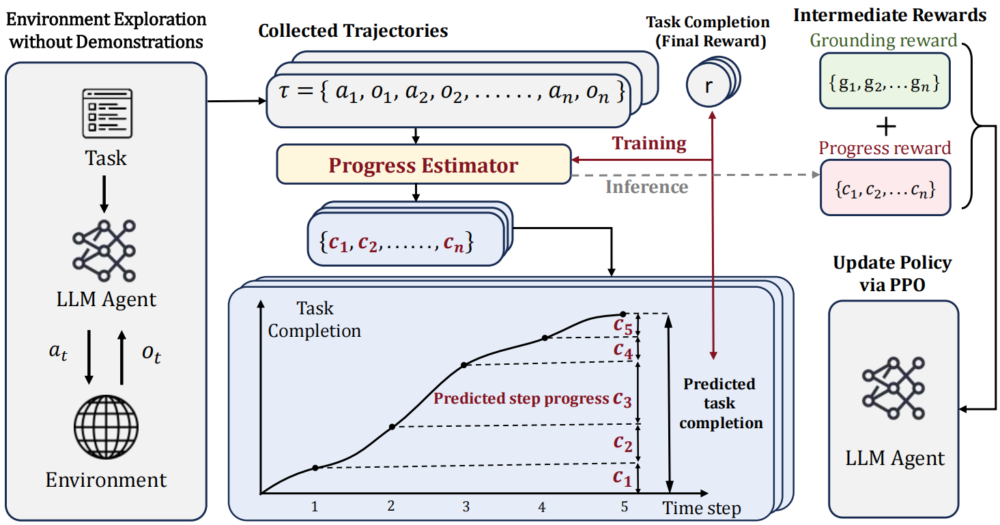

<div align="center">

# Step-RL

**面向长程语言智能体训练的逐步奖励框架**

将稀疏的任务结果转化为细粒度进度信号，覆盖监督微调、轨迹探索、进度评估、PPO 训练与智能体评测的完整流程。

[English](README.md) · 简体中文


[](LICENSE)

[项目简介](#项目简介) · [训练流程](#训练流程) · [安装](#安装) · [使用方法](#使用方法) · [项目结构](#项目结构) · [许可证](#许可证)

</div>

---

## 项目简介

Step-RL 是一个面向多步语言智能体强化学习的研究型工具集。它关注长程任务中的一个典型难题：环境通常只在轨迹结束时提供有效奖励，因此很难判断中间的哪些动作推动了任务进展，哪些动作阻碍了任务完成。

本项目围绕逐步进度评估组织了一套端到端训练流程：

- 对基础智能体进行监督微调；
- 通过环境交互采集完整轨迹；
- 训练进度评估模型；
- 为轨迹标注步骤级奖励；
- 使用 LoRA 和 PPO 优化策略；
- 在交互式智能体环境中进行评测。

仓库目前包含 **WebShop**、**ALFWorld** 和 **VirtualHome** 的集成与脚本。当前代码中，WebShop 的探索流程最为完整；另外两个环境仍需要额外的数据集、模型检查点和环境配置。

<p align="center">
  
</p>

## 为什么需要逐步奖励？

传统的结果奖励通常只把整条轨迹视为一次成功或失败。Step-RL 则尝试估计每一步带来的任务进展变化，为长程、多轮交互提供更密集的学习信号。

| 挑战 | Step-RL 的处理方式 |
| --- | --- |
| 终局奖励稀疏 | 将轨迹级结果重新分配为中间步骤奖励 |
| 信用分配链路过长 | 估计相邻步骤之间的进度变化 |
| 在线交互成本较高 | 复用已采集轨迹训练进度模型和 PPO 策略 |
| 多环境评测复杂 | 通过统一的智能体与评测接口封装任务环境 |

## 训练流程


### 核心阶段

1. **监督微调（SFT）**：使用专家轨迹训练具备任务执行能力的基础策略。
2. **环境探索**：让基础策略与环境交互，并记录完整任务轨迹。
3. **进度评估**：训练模型估计当前状态下的任务完成程度。
4. **奖励标注**：根据连续步骤之间的进度变化生成步骤级奖励。
5. **PPO 训练**：使用标注后的轨迹进一步优化智能体策略。
6. **智能体评测**：在目标环境中评估最终策略的任务表现。

## 项目结构

```text
Step-RL/
├── assets/          # 架构图与文档图片
├── config/          # PPO 与训练配置
├── envs/            # 交互式环境，包含 WebShop
├── eval/            # 评测启动脚本
├── eval_agent/      # 智能体、任务、提示词和环境适配器
├── exploration/     # 轨迹采集脚本与示例输出
├── fastchat/        # 经过适配的训练与模型服务组件
├── ppo/             # 逐步奖励 PPO 实现与检查点合并
├── prm/             # 进度评估模型训练与数据处理
├── sft/             # 监督微调脚本
├── LICENSE
└── requirements.txt
```

## 运行要求

完整训练流程面向配备 NVIDIA GPU 的 Linux 机器设计。

- Python 3.9：用于智能体环境与评测；
- Python 3.10：用于 PPO 训练；
- 与本机 CUDA 版本匹配的 PyTorch；
- 一张或多张具有足够显存的 NVIDIA GPU；
- Java 11：用于 WebShop 搜索环境；
- 足够的存储空间：用于模型、数据集、搜索索引和训练检查点。

> macOS 可以用于阅读代码和执行轻量级数据处理，但项目中的 CUDA、vLLM、FlashAttention、DeepSpeed 和分布式训练命令主要面向 Linux/NVIDIA 环境。

## 安装

### 1. 克隆仓库

```bash
git clone https://github.com/Shaw-Liu7/Step-Reinforcement-Learning.git
cd Step-RL
```

### 2. 创建评测环境

请先根据本机 CUDA 版本安装相匹配的 PyTorch，再安装项目依赖。

```bash
conda create -n step-rl-eval python=3.9 -y
conda activate step-rl-eval

# 请先安装与本机 CUDA 版本匹配的 PyTorch。
pip install -r requirements.txt
pip install -r eval_agent/requirements.txt
pip install gdown
```

当前评测代码使用旧版 OpenAI Python 客户端接口，因此 `eval_agent/requirements.txt` 固定了兼容的客户端版本。

### 3. 安装 WebShop

```bash
pip install -e envs/webshop
python -m spacy download en_core_web_lg
conda install -y -c conda-forge openjdk=11
```

### 4. 创建 PPO 训练环境

由于 PPO 训练所需的依赖版本与评测环境不同，建议使用独立环境。

```bash
conda create -n step-rl-train python=3.10 -y
conda activate step-rl-train
pip install -r ppo/requirements.txt
```

## 数据准备

仓库没有完整保存数据集和搜索索引。以下命令均应在仓库根目录下执行。

### WebShop

```bash
cd envs/webshop

gdown "https://drive.google.com/uc?id=1G_0ccLWn5kZE5rpeyAdh_YuoNzvBUjT9" -O webshop_data.zip
gdown "https://drive.google.com/uc?id=11zOUDkJSgGhYin9NxQtG8PVpDsika86y" -O webshop_indexes.zip

unzip webshop_data.zip
mkdir -p search_index
unzip webshop_indexes.zip -d search_index/

cd ../..
```

### ALFWorld

```bash
mkdir -p eval_agent/data/alfworld
gdown "https://drive.google.com/uc?id=1y7Vqeo0_xm9d3I07vZaP6qbPFtyuJ6kI" \
  -O eval_agent/data/alfworld/alfworld_data.zip
unzip eval_agent/data/alfworld/alfworld_data.zip -d eval_agent/data/alfworld/
```

### VirtualHome

```bash
gdown "https://drive.google.com/uc?id=1kZKWkWhtJ-DneqfS1Nb_FybR1RBxPeef" \
  -O virtualhome_master.zip
unzip virtualhome_master.zip
```

### 专家轨迹

```bash
gdown "https://drive.google.com/uc?id=1_tBMDixZcIjKuv-LExNllha-YIRxhKIq" \
  -O expert_trajectories.zip
unzip expert_trajectories.zip
```

开始训练前，请确认 SFT 和评测脚本引用的路径与实际解压后的目录结构一致。

## 配置说明

启动脚本保留了一组用于复现实验的默认值，运行前需要根据本机环境进行调整。

| 配置项 | 修改位置 |
| --- | --- |
| 基础模型路径 | `sft/*.sh`、`ppo/train_ppo.sh`、`eval/*.sh` |
| CUDA 设备 | 各启动脚本中的 `CUDA_VISIBLE_DEVICES` |
| GPU 数量 | SFT 脚本中的 `node_num` 和 `--nproc_per_node` |
| 检查点路径 | `ckt/`、`ckpt/` 和 `MODEL_PATH` |
| PPO 超参数 | `config/StepTool_ppo.json` |
| 环境数据路径 | `eval_agent/configs/task/*.json` |
| 输出目录 | 评测、探索、PRM 和 PPO 的启动参数 |
| Controller 与 Worker 端口 | 探索和评测脚本 |

请勿提交本机绝对路径、API key、模型权重或实验平台凭据。机器相关配置应优先通过环境变量或命令行参数传入。

## 使用方法

下面的命令均假定当前目录为仓库根目录。

### 1. 监督微调

选择目标环境，并在启动前修改模型、数据、GPU 和输出路径。

```bash
# WebShop
bash sft/webshop_llama3b.sh

# ALFWorld
bash sft/alfworld_llama3b.sh

# VirtualHome
bash sft/virtualhome_llama3b.sh
```

### 2. WebShop 轨迹探索

请分别在三个终端中启动 Controller、模型 Worker 和探索客户端。

终端 1——启动 Controller：

```bash
conda activate step-rl-eval
bash exploration/webshop/run_controller.sh
```

终端 2——启动模型 Worker：

```bash
conda activate step-rl-eval
bash exploration/webshop/run_vllm.sh
```

终端 3——启动探索客户端：

```bash
conda activate step-rl-eval
python exploration/webshop/generate_response_webshop.py \
  --agent_config fastchat_explore \
  --iteration_num 3 \
  --exp_config webshop \
  --model_name llama3b_webshop_sft_loramerged \
  --part_num 1 \
  --part_idx 0 \
  --save_path exploration/webshop/exploration_outputs/explore
```

### 3. 构建进度评估数据

```bash
python prm/data_org.py
```

针对新的轨迹集合运行前，请先检查脚本中的输入和输出路径。

### 4. 训练进度评估模型

```bash
deepspeed --include=localhost:0,1,2,3 prm/train_our_progress_model.py
```

`prm/` 目录还提供了 LoRA 和低精度训练版本。

### 5. 标注逐步奖励

```bash
python prm/inference_prm.py
```

### 6. 构建 PPO 数据

```bash
python prm/rl_data_org.py
```

### 7. PPO 训练

```bash
conda activate step-rl-train
bash ppo/train_ppo.sh
```

### 8. 合并 LoRA 权重

```bash
python ppo/merge.py
```

运行前请在 `ppo/merge.py` 中更新基础模型、适配器和输出路径。

### 9. 智能体评测

```bash
conda activate step-rl-eval

bash eval/llama3_2_3b_eval_webshop.sh
bash eval/llama3_2_3b_eval_alfworld.sh
bash eval/llama3_2_3b_eval_virtualhome.sh
```

每个评测脚本都要求对应数据集和合并后的模型检查点已经准备完成，并位于配置指定的位置。

## 复现清单

为了让实验结果可复现，建议为每次实验记录以下信息：

- 基础模型名称与具体版本；
- 数据集版本与数据划分；
- 随机种子；
- GPU 型号与数量、CUDA 版本和 PyTorch 版本；
- SFT、进度评估模型和 PPO 的超参数；
- 模型检查点和 LoRA 适配器版本；
- 评测命令与环境配置；
- 平均分、方差和重复实验次数。

请勿将大型模型检查点、下载的数据压缩包、搜索索引、日志或实验缓存提交到 Git。建议将它们保存到独立的制品存储中，并在文档中提供稳定的下载地址和校验值。

## 当前范围与限制

- 本项目是研究代码，不是生产级智能体平台。
- 端到端训练需要额外下载数据集和模型检查点。
- 默认脚本假设使用 Linux、NVIDIA CUDA 和特定的 GPU 布局。
- 当前代码中 WebShop 的本地探索流程最为完整。
- ALFWorld 和 VirtualHome 仍需要额外环境资源及路径验证。
- 完整训练和基准复现可能消耗大量计算资源。

## 安全

请勿将任何凭据直接写入配置文件。应通过环境变量加载：

```bash
export OPENAI_API_KEY="your-key"
export WANDB_API_KEY="your-key"
```

`.env` 只能用于本地开发，并应加入 Git 忽略列表。如果某个凭据曾经出现在源码或公开仓库中，请立即撤销并轮换。

## 致谢

Step-RL 借鉴并使用了以下开源项目的思路或组件：

- [SPA-RL-Agent](https://github.com/WangHanLinHenry/SPA-RL-Agent)
- [ETO](https://github.com/Yifan-Song793/ETO)
- [StepTool](https://github.com/yuyq18/steptool)
- [FastChat](https://github.com/lm-sys/FastChat)
- [WebShop](https://github.com/princeton-nlp/WebShop)

第三方组件的署名、版权和相关权利仍归其原作者与维护者所有。

## 许可证

仓库级许可证见 [LICENSE](LICENSE)。第三方组件、数据集、模型权重和环境资源可能受各自许可证或使用条款约束，使用和再分发前请核对并保留所有适用的版权及许可声明。

## 参与贡献

欢迎提交 Issue 和 Pull Request。提出修改时，建议同时提供：

- 修改动机及受影响的流程阶段；
- 使用的运行环境和依赖版本；
- 最小可复现命令；
- 不包含密钥或隐私数据的相关日志与指标；
- 针对行为变化的测试或验证步骤。

---

<div align="center">

**Step-RL——用密集进度信号训练长程智能体。**

</div>
